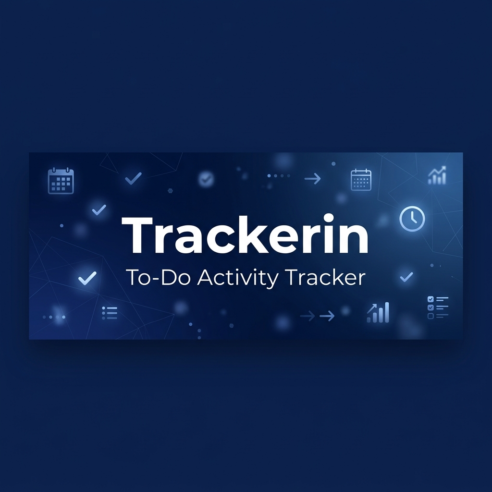
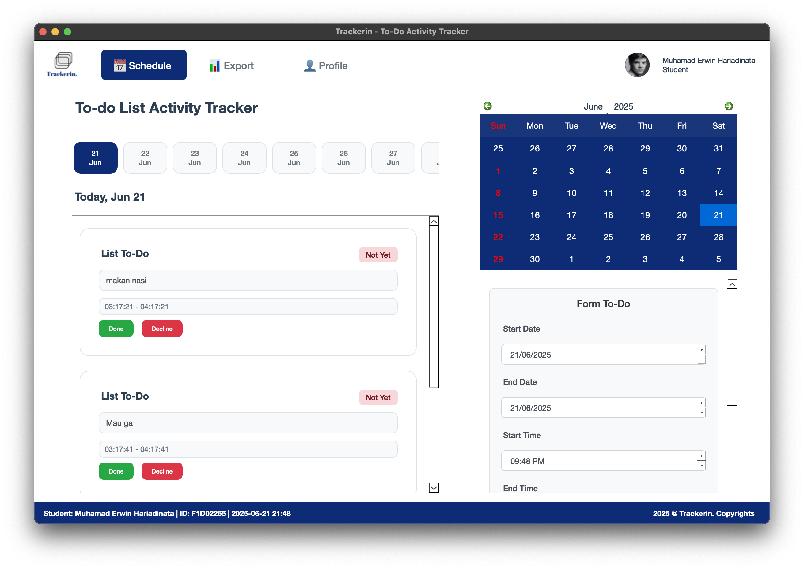
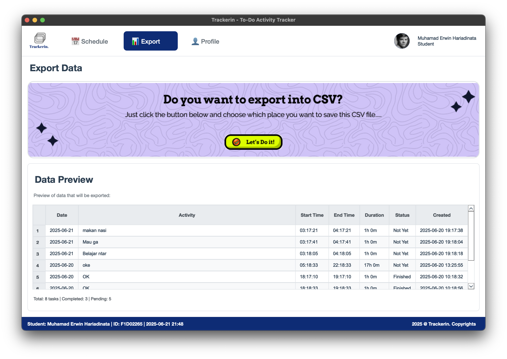
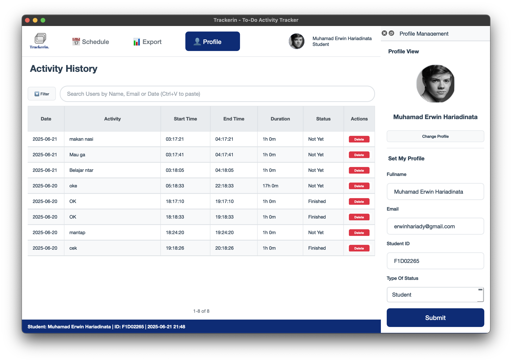
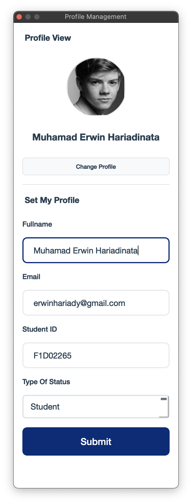
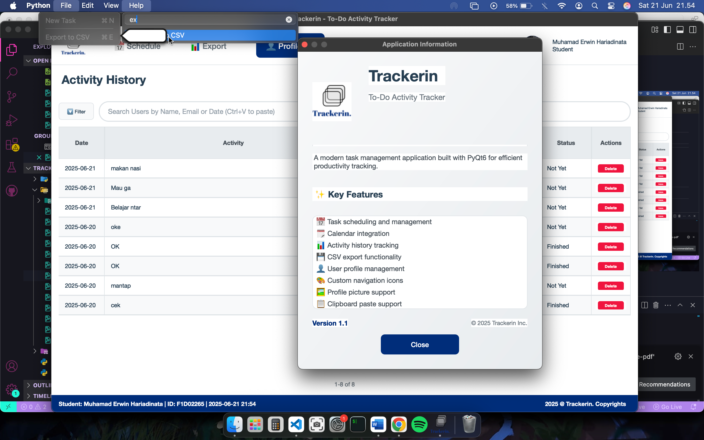
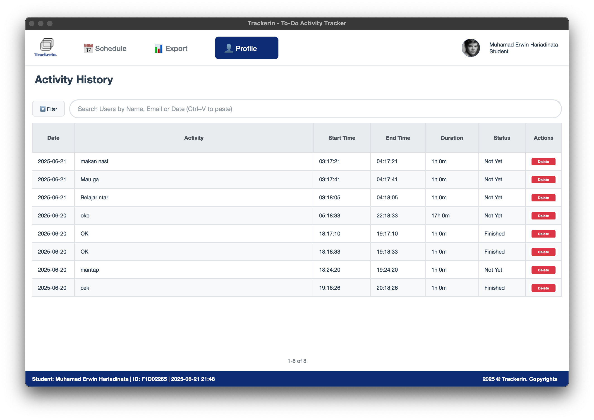

<div align="center">

<!-- HERO BANNER -->


<br/>


<br/>

### ⚡ Schedule · Track · Export · Achieve

<br/>

[](https://python.org)
[](https://www.riverbankcomputing.com/software/pyqt/)
[](https://sqlite.org)
[]()
[]()
[]()

<br/>

> **Trackerin** is a full-featured desktop productivity app that lets you schedule, track, and export daily activities — wrapped in a clean, professional interface built entirely with Python & PyQt6.  
> This project showcases end-to-end desktop application engineering: from database design to pixel-perfect UI polish.

<br/>

<a href="#-app-showcase">📸 Showcase</a>&nbsp;&nbsp;•&nbsp;&nbsp;<a href="#-features-overview">✨ Features</a>&nbsp;&nbsp;•&nbsp;&nbsp;<a href="#-architecture--engineering">🏗 Architecture</a>&nbsp;&nbsp;•&nbsp;&nbsp;<a href="#-under-the-hood">⚙ How It Works</a>&nbsp;&nbsp;•&nbsp;&nbsp;<a href="#-getting-started">🚀 Get Started</a>&nbsp;&nbsp;•&nbsp;&nbsp;<a href="#-development-journey">📐 Process</a>

</div>

<br/>

---

<br/>

## 📸 App Showcase

<div align="center">

### 📅 Schedule Management
*Create, manage, and track tasks with an interactive calendar and day selector*



<br/><br/>

### 📊 Data Export
*Preview all your data and export to CSV with one click*



<br/><br/>

### 👤 Profile & Activity History
*Full activity history table with search, filter, and inline editing — paired with a dockable profile panel*

<table>
<tr>
<td></td>
<td></td>
</tr>
</table>

<br/>

### 🔧 Menu Bar, About Dialog & Full Profile
*Professional menu system with keyboard shortcuts and a polished about dialog*

<table>
<tr>
<td></td>
<td></td>
</tr>
</table>

</div>

<br/>

---

<br/>

## ✨ Features Overview

<div align="center">

| | Feature | Description |
|:---:|:---|:---|
| 📅 | **Smart Scheduling** | Visual 14-day day selector, integrated calendar widget, task cards with real-time status |
| ✏️ | **Inline Editing** | Double-click any cell in the activity table to edit it live — with format validation |
| 🔍 | **Search & Filter** | Real-time search across activity names and descriptions, with filter presets |
| 📊 | **CSV Export** | Preview data, check statistics, and export to CSV with auto-timestamped filenames |
| 👤 | **Profile System** | Circular profile picture, user info management, dockable sidebar panel |
| 🎨 | **Design System** | 637-line centralized styling engine with color tokens, platform-adaptive typography |
| ⌨️ | **Keyboard Shortcuts** | Ctrl+N (new task), Ctrl+E (export), Ctrl+V (paste), Ctrl+Q (quit), F1 (about) |
| 🔄 | **Signal Architecture** | PyQt6 signal-slot for decoupled, real-time UI updates across all components |
| 🛡️ | **Error Handling** | Comprehensive try-catch, input validation, confirmation dialogs for destructive actions |
| 🖥️ | **Cross-Platform** | Runs natively on Windows, macOS, and Linux with platform-specific font fallbacks |

</div>

<br/>

---

<br/>

## 🏗 Architecture & Engineering

<div align="center">

> *"Clean architecture isn't about frameworks — it's about making things easy to change."*

</div>

<br/>

The project follows a **modular MVC-inspired architecture** with clear separation between data, presentation, and logic layers.

### 📁 Project Structure

```
TrackerinApp/
│
├── 🚀 main.py                →  Entry point · Platform detection · Font system
│
├── 🧩 CORE MODULES
│   ├── main_window.py        →  Navigation shell · Header · Dock · Menu/Status bar
│   ├── schedule_page.py      →  Day selector · Task cards · Calendar · Input form
│   ├── profile_page.py       →  Activity table · Search/Filter · Profile dock
│   └── export_page.py        →  Data preview · CSV export · Statistics
│
├── 💾 DATA LAYER
│   └── database.py           →  DatabaseHandler — All CRUD + search logic
│
├── 🎨 DESIGN SYSTEM
│   └── styles.py             →  Centralized color tokens & component styles
│
├── 📦 ASSETS
│   ├── assets/               →  Logo · Banner · Profile pictures · Screenshots
│   └── assets/icons/         →  Navigation state icons (default/clicked)
│
└── 🖼 UI LAYOUTS
    └── UI/                   →  6 Qt Designer .ui layout files
```

### 🔀 System Architecture

```
                          ┌─────────────────────────────────┐
                          │         QApplication             │
                          │          (main.py)               │
                          │  • OS Detection  • Font Setup    │
                          └──────────┬──────────────────────┘
                                     │
                    ┌────────────────┴────────────────┐
                    │                                 │
                    ▼                                 ▼
  ┌──────────────────────────────┐   ┌──────────────────────────────┐
  │      MainWindow              │   │      DatabaseHandler          │
  │     (main_window.py)         │   │      (database.py)            │
  │                              │   │                               │
  │  ┌────────────────────────┐  │   │   ┌───────┐   ┌───────────┐  │
  │  │ Header                 │  │   │   │ tasks │   │user_profile│  │
  │  │ [Logo][Nav][User Info] │  │◄─►│   └───────┘   └───────────┘  │
  │  └────────────────────────┘  │   │                               │
  │                              │   │   • add_task()                │
  │  ┌────────────────────────┐  │   │   • get_tasks_by_date()       │
  │  │ QStackedWidget         │  │   │   • update_task_status()      │
  │  │ ┌──────────────────┐   │  │   │   • search_tasks()            │
  │  │ │  SchedulePage    │   │  │   │   • get/update_profile()      │
  │  │ │  ExportPage      │   │  │   │   • get_task_statistics()     │
  │  │ │  ProfilePage     │   │  │   └───────────────────────────────┘
  │  │ └──────────────────┘   │  │
  │  └────────────────────────┘  │       ┌─────────────────────────┐
  │                              │       │      styles.py           │
  │  ┌────────────────────────┐  │       │                          │
  │  │ QDockWidget            │  │       │   COLORS = { ... }       │
  │  │ (Profile Management)   │◄─┼──────►│   Styles.HEADER_STYLE   │
  │  └────────────────────────┘  │       │   Styles.TASK_CARD_STYLE │
  │                              │       │   Styles.TABLE_STYLE     │
  │  ┌────────────────────────┐  │       │   + 15 more components   │
  │  │ Status Bar / Menu Bar  │  │       └─────────────────────────┘
  │  └────────────────────────┘  │
  └──────────────────────────────┘
```

### 🧠 Design Decisions

<table>
<tr>
<td width="40%">

**🔌 Signal-Slot Pattern**

Components communicate through PyQt6 signals — no tight coupling. `TaskCard` emits `task_updated`, and whoever is listening reacts.

```python
task_updated = pyqtSignal()
# TaskCard doesn't need to know
# SchedulePage exists
```

</td>
<td width="60%">

**📡 Signal-Slot Communication Map**

```
TaskCard.task_updated          ──▶  SchedulePage.refresh_tasks()
ProfilePage.profile_updated    ──▶  MainWindow.refresh_header_profile()
QCalendarWidget.clicked        ──▶  SchedulePage.select_date()
QTimer.timeout                 ──▶  MainWindow.safe_update_status_bar()
QTableWidget.itemDoubleClicked ──▶  ProfilePage.edit_task_column()
```

</td>
</tr>
</table>

<br/>

| Decision | Why? |
|:---------|:-----|
| **One file per page** | Self-contained modules — add features without touching unrelated code |
| **Centralized `styles.py`** | Single source of truth — change the entire theme from one file |
| **`DatabaseHandler` abstraction** | Views never write raw SQL — data layer is independently testable |
| **`QDockWidget` for profile** | Real desktop UX: users can dock, float, resize, or hide the panel |
| **Context managers for DB** | `with sqlite3.connect()` — auto commit, auto rollback, auto cleanup |

<br/>

---

<br/>

## ⚙ Under the Hood

### 📋 Task Lifecycle Flow

```
         ┌─────────────┐         ┌──────────────────┐         ┌──────────────────┐
         │  USER INPUT  │         │   VALIDATION     │         │    DATABASE      │
         │              │         │                  │         │                  │
         │  📅 Dates    │  ────▶  │  ✓ Empty check   │  ────▶  │  INSERT INTO     │
         │  ⏰ Times    │         │  ✓ Past date     │         │  tasks (...)     │
         │  📝 Activity │         │  ✓ Time logic    │         │  → commit()      │
         └─────────────┘         └──────────────────┘         └────────┬─────────┘
                                                                       │
                    ┌──────────────────────────────────────────────────┘
                    │
                    ▼
         ┌──────────────────────────────┐
         │       TASK CARD RENDERED      │
         │                              │
         │  ┌────────────────────────┐  │
         │  │ List To-Do   [Not Yet] │  │
         │  │                        │  │
         │  │ Activity Name          │  │
         │  │ 09:00 AM - 11:00 AM   │  │
         │  │                        │  │
         │  │ [✓ Done]  [✗ Decline]  │  │
         │  └────────────────────────┘  │
         │                              │
         └──────────┬───────────────────┘
                    │
           ┌───────┴────────┐
           ▼                ▼
     ┌──────────┐    ┌───────────┐
     │  ✓ Done  │    │ ✗ Decline │
     │  UPDATE  │    │ Confirm?  │
     │  status  │    │ → DELETE  │
     └──────────┘    └───────────┘
```

### 🔄 Real-Time Profile Sync Chain

When a user updates their profile, a **cascade of signals** keeps the entire UI in perfect sync:

```
  ┌─────────────────────────────────────────────────────────────────────────┐
  │                                                                         │
  │   Profile Form Submit                                                   │
  │         │                                                               │
  │         ▼                                                               │
  │   DatabaseHandler.update_user_profile()                                 │
  │         │                                                               │
  │         ▼                                                               │
  │   profile_updated.emit()                          ← PyQt Signal         │
  │         │                                                               │
  │         ├──▶ MainWindow.refresh_header_profile()                        │
  │         │         └── 🖼 Updates name + circular profile pic in header  │
  │         │                                                               │
  │         └──▶ MainWindow.safe_update_status_bar()                        │
  │                   └── 📊 Updates student info in bottom status bar      │
  │                                                                         │
  └─────────────────────────────────────────────────────────────────────────┘
```

### 🧪 Key Implementation Highlights

<table>
<tr>
<td width="50%">

**⏱ Smart Duration Calculator**

Handles normal tasks *and* overnight tasks automatically:

```python
def calculate_duration(self, start_time, end_time):
    start = datetime.strptime(start_time, "%H:%M:%S")
    end = datetime.strptime(end_time, "%H:%M:%S")
    
    diff = end - start
    if diff.total_seconds() < 0:
        diff += timedelta(days=1)  # overnight!
    
    hours = int(diff.total_seconds() // 3600)
    minutes = int((diff.total_seconds() % 3600) // 60)
    return f"{hours}h {minutes}m"
```

</td>
<td width="50%">

**🖼 Circular Profile Picture**

Transforms any uploaded image into a perfect circle:

```python
# Load & scale
pixmap = QPixmap(path).scaled(
    100, 100, Qt.KeepAspectRatio,
    Qt.SmoothTransformation
)

# Circular mask with QPainter
circular = QPixmap(100, 100)
circular.fill(Qt.transparent)
painter = QPainter(circular)
painter.setRenderHint(QPainter.Antialiasing)
painter.setBrush(QBrush(pixmap))
painter.drawEllipse(0, 0, 100, 100)
painter.end()
```

</td>
</tr>
<tr>
<td width="50%">

**🖥 Platform-Adaptive Fonts**

Detects the OS and cascades through native font priorities:

```python
# macOS   →  Helvetica Neue → Arial → System
# Windows →  Segoe UI → Arial  
# Linux   →  Ubuntu → DejaVu Sans → Arial

font = QFont("Helvetica Neue", 10)
if not font.exactMatch():
    font = QFont("Arial", 10)
```

</td>
<td width="50%">

**🔒 Safe Database Operations**

Every query uses prepared statements and context managers:

```python
def add_task(self, title, desc, ...):
    try:
        with sqlite3.connect(self.db_path) as conn:
            cursor = conn.cursor()
            cursor.execute('''
                INSERT INTO tasks 
                (title, description, ...)
                VALUES (?, ?, ...)
            ''', (title, desc, ...))
            conn.commit()
            return True
    except sqlite3.Error:
        return False
```

</td>
</tr>
</table>

<br/>

---

<br/>

## 🎨 Design System

<div align="center">

*The entire visual identity is controlled from a single file — `styles.py` (637 lines)*

</div>

<br/>

### 🎯 Color Palette

<table>
<tr>
<td align="center">

**Primary**<br/>
<br/>
`#0E2C75`<br/>
Deep Navy

</td>
<td align="center">

**Secondary**<br/>
<br/>
`#f8f9fa`<br/>
Cloud Gray

</td>
<td align="center">

**Success**<br/>
<br/>
`#28a745`<br/>
Emerald

</td>
<td align="center">

**Danger**<br/>
<br/>
`#dc3545`<br/>
Crimson

</td>
<td align="center">

**Warning**<br/>
<br/>
`#ffc107`<br/>
Amber

</td>
<td align="center">

**Text**<br/>
<br/>
`#2c3e50`<br/>
Dark Slate

</td>
</tr>
</table>

### 🧱 Component Styling

| Component | Style |
|:----------|:------|
| **Nav Buttons** | `transparent` → `#0E2C75` fill on active · smooth hover · `border-radius: 8px` |
| **Task Cards** | White surface · `border-radius: 15px` · subtle `#dee2e6` border · status badge (🟢/🔴) |
| **Calendar** | Full navy theme · highlighted selection · red Sundays · custom spin box |
| **Tables** | Alternating rows `#fff`/`#f8f9fa` · bold headers · `#0E2C75` selection highlight |
| **Profile Pic** | Circular QPainter crop · antialiased · stored as resized copy in `/assets` |
| **Status Bar** | Navy `#0E2C75` background · white text · live clock · student info |
| **Input Fields** | `border-radius: 8px` · `#e9ecef` border → `#0E2C75` on focus · `min-height: 20px` |

### 📝 Typography System

| Platform | Primary | Fallback | Size |
|:---------|:--------|:---------|:-----|
| 🍎 macOS | Helvetica Neue | Arial → System | 10pt |
| 🪟 Windows | Segoe UI | Arial | 10pt |
| 🐧 Linux | Ubuntu | DejaVu Sans → Arial | 10pt |

<br/>

---

<br/>

## 🛠 Tech Stack

<div align="center">

| | Technology | Role |
|:---:|:---|:---|
| 🐍 | **Python 3.8+** | Core application logic |
| 🖼 | **PyQt6** | Desktop GUI framework — widgets, layouts, signals |
| 💾 | **SQLite3** | Lightweight embedded database — zero config |
| 🎨 | **Qt StyleSheet (QSS)** | Component-based styling with design tokens |
| ✂️ | **QPainter + QPixmap** | Image processing — circular crop, icon rendering |
| 📄 | **Python `csv`** | UTF-8 CSV export with timestamped filenames |
| 🖼 | **Qt Designer** | 6 `.ui` layout files for rapid prototyping |

</div>

### 📊 Codebase Breakdown

```
  profile_page.py   ████████████████████████████████████████  733 lines
  main_window.py    ██████████████████████████████████████    656 lines
  styles.py         █████████████████████████████████████     637 lines
  schedule_page.py  ██████████████████████████████           572 lines
  export_page.py    ██████████████████████                   406 lines
  database.py       █████████████                            267 lines
  main.py           ██                                        43 lines
                                                    ─────────────────
                                                    Total: 3,314 lines
```

<br/>

---

<br/>

## 🗄 Database Schema

<table>
<tr>
<td width="50%">

**📋 `tasks` Table**

```sql
CREATE TABLE tasks (
  id          INTEGER PRIMARY KEY AUTOINCREMENT,
  title       TEXT NOT NULL,
  description TEXT,
  start_date  DATE NOT NULL,
  end_date    DATE,
  start_time  TIME NOT NULL,
  end_time    TIME NOT NULL,
  status      TEXT DEFAULT 'Not Yet',
  created_at  TIMESTAMP DEFAULT CURRENT_TIMESTAMP,
  updated_at  TIMESTAMP DEFAULT CURRENT_TIMESTAMP
);
```

</td>
<td width="50%">

**👤 `user_profile` Table**

```sql
CREATE TABLE user_profile (
  id              INTEGER PRIMARY KEY AUTOINCREMENT,
  fullname        TEXT NOT NULL,
  email           TEXT,
  student_id      TEXT,
  status_type     TEXT DEFAULT 'Student',
  profile_picture TEXT,
  created_at      TIMESTAMP DEFAULT CURRENT_TIMESTAMP,
  updated_at      TIMESTAMP DEFAULT CURRENT_TIMESTAMP
);
```

</td>
</tr>
</table>

**Key Design Choices:**

> 🔒 **Prepared statements** on all queries — SQL injection protection  
> 🔄 **Context managers** for connections — auto-cleanup, auto-rollback  
> 📊 **Smart sorting** — `ORDER BY CASE status WHEN 'Finished' THEN 0 ELSE 1 END`  
> 🔍 **LIKE search** — instant filtering across `title` and `description`

<br/>

---

<br/>

## 🚀 Getting Started

```bash
# 1️⃣ Clone
git clone https://github.com/yourusername/trackerin.git
cd trackerin

# 2️⃣ Install (just one dependency!)
pip install PyQt6

# 3️⃣ Run
python main.py
```

> **Note:** SQLite is built into Python — no database setup needed. The app creates `trackerin.db` automatically on first launch.

<details>
<summary><b>📁 Full Project Structure</b></summary>

```
trackerin/
├── assets/
│   ├── logo.png              # App branding
│   ├── hero_banner.png       # README hero banner
│   ├── Frame 182.png         # Export page banner
│   ├── Standard.png          # Default assets
│   ├── icons/                # Navigation icons (default/clicked states)
│   └── ss_*.png              # Application screenshots
├── UI/                       # Qt Designer layout files (6 files)
├── main.py                   # ← Entry point
├── main_window.py            # Navigation & layout management
├── schedule_page.py          # Task scheduling interface
├── profile_page.py           # Profile & activity history
├── export_page.py            # Data export interface
├── database.py               # Database operations
├── styles.py                 # Design system
└── trackerin.db              # Auto-created on first launch
```

</details>

### System Requirements

| Requirement | Minimum |
|:------------|:--------|
| **Python** | 3.8+ |
| **OS** | Windows 10/11, macOS 10.14+, Linux Ubuntu 18.04+ |
| **RAM** | 4 GB |
| **Storage** | 100 MB |

<br/>

---

<br/>

## 🧠 Challenges & Solutions

<div align="center">

*Real engineering problems that went beyond textbook examples*

</div>

<br/>

| 🔴 Challenge | ✅ Solution |
|:-------------|:-----------|
| **Circular profile picture rendering** | `QPainter` with antialiasing + `QBrush` texture mapping to mask square → perfect circle |
| **Calendar ↔ Day Selector synchronization** | Shared `current_date` state — both widgets call `select_date()` to reconcile all UI |
| **SQLite database locking** | Python `with sqlite3.connect()` context manager — auto commit, rollback, cleanup |
| **QPixmap memory leaks** | Explicit cleanup cycles, avoiding persistent pixmap references in render loops |
| **Duplicate signal connections** | `try: disconnect() except TypeError: pass` before every `connect()` call |
| **Cross-platform font rendering** | Cascading font fallback with `exactMatch()` — native feel on all 3 platforms |

<br/>

---

<br/>

## 📐 Development Journey

<div align="center">

```
  ┌────────────────────────────────────────────────────────────────────────┐
  │                                                                        │
  │   Phase 1                  Phase 2                  Phase 3            │
  │   PLANNING                 BUILDING                 INTEGRATION        │
  │                                                                        │
  │   📋 Requirements          💾 DatabaseHandler        🔗 Signal-slot     │
  │   🔧 Tech stack            🧩 MainWindow             🎨 styles.py      │
  │   🗄 Schema design    ──▶  📅 SchedulePage     ──▶  📋 Menu bar        │
  │   🖼 UI wireframes         👤 ProfilePage             📊 Status bar    │
  │                            📊 ExportPage                               │
  │                                                                        │
  │                                       │                                │
  │                                       ▼                                │
  │                                                                        │
  │                              Phase 4                                   │
  │                              POLISH                                    │
  │                                                                        │
  │                              🛡 Error handling                         │
  │                              ✓ Input validation                        │
  │                              🧪 Edge cases                             │
  │                              🖥 Cross-platform testing                 │
  │                                                                        │
  └────────────────────────────────────────────────────────────────────────┘
```

</div>

<br/>

---

<br/>

## 🔮 Roadmap

<table>
<tr>
<td>

### Now — v1.1 ✅
- ✅ Full CRUD task management
- ✅ Calendar + day selector
- ✅ Profile with photo upload
- ✅ Activity history table
- ✅ CSV export with preview
- ✅ Cross-platform support
- ✅ Centralized design system

</td>
<td>

### Next — v1.2+
- 🌙 Dark mode toggle
- 📄 PDF & Excel export
- 🔔 Desktop notifications
- 📈 Analytics dashboard
- ☁️ Cloud sync
- 👥 Team collaboration

</td>
</tr>
</table>

<br/>

---

<br/>

## 👨‍💻 Author

<div align="center">

**Muhamad Erwin Hariadinata**

Student ID: **F1D022065**

Visual Programming — Semester 6 · 2025

[](mailto:erwinhariady@gmail.com)

</div>

<br/>

---

<div align="center">


<br/>

*Built as a semester project for Visual Programming coursework*  
*Showcasing PyQt6 desktop development, database integration, and UI/UX design*

<br/>

**Made with ❤️ and Python**

**© 2025 Trackerin**

</div>
